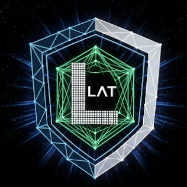

#  LATTICE ($LAT)

LATTICE is a decentralized verification infrastructure designed to protect the Base ecosystem against quantum computation threats through the modular VERA Protocol.

### 🌐 Official Links
- **Website:** https://lattice-labs-base.github.io/lattice/
- **Telegram:** t.me/Lattice_LAT
- **BaseScan (Mainnet Asset Layer):** https://basescan.org/token/0x0a320C8daC9fB56C7FC766CDF2c6068949fa4B74

### 📊 Project Status
- **Current Core Phase:** Phase 4: Automated On-Chain Anchoring & E2E Pipeline Active
- **Asset Settlement:** Base Mainnet ($LAT Token Layer)
- **Verification Engine:** Render (Go ML-DSA-87 Backend)
- **Blockchain Anchor:** Base Sepolia (Automated Proof Anchoring)
- **Security & Integrity:** Production-Oriented Core Architecture (Proprietary Middleware Engine with Publicly Verifiable Anchors)
- **LAT Token Contract:** `0x0a320C8daC9fB56C7FC766CDF2c6068949fa4B74`
- **VERA Anchor Contract (Base Sepolia V5):** `0x223214bd2C52D2ACBF22f87a8b6C3aED1C6D9A03`

---

### 🏗️ System Architecture

[ Web3 Wallet / DApp ]
        │
        ▼
[ Frontend (Vercel) ]
        │
        ▼
[ Verification API (Proxy) ]
        │
        ▼
[ Render Go Engine (ML-DSA-87) ]
        │
        ▼
[ Base Sepolia Anchor Contract ]

---

### 🚀 VERA Sandbox Terminal (Live Proof of Concept)
Experience our live end-to-end post-quantum cryptographic verification Proof of Concept (PoC). The terminal demonstrates how standard EVM user pipelines sync with a native ML-DSA-87 backend engine, anchoring cryptographic parameters directly onto the Base Sepolia blockspace in automated real-time transactions.
- **Live Demo Sandbox Website:** https://lattice-labs-base.github.io/lattice/
- **Launch Sandbox DApp (Vercel):** https://sdk-nu-red.vercel.app

### 🛡️ Core Architecture & Technical Workflow
The VERA Protocol utilizes a dual-key routing topology that decouples standard ledger authorization from quantum-safe proof anchoring, enforcing "Extend, not Replace" integration:

1. **Identity & Connectivity (CONNECT)**: Intercepts standard Web3 pipeline payloads from user interactions. Detects network parity on Base Sepolia (Chain ID: `0x14A34`).
2. **Lattice Payload Computation (SECURE)**: The secure backend performs native ML-DSA-87 signing and verification using lattice-based cryptographic primitives based on the ML-DSA algorithm standardized in NIST FIPS 204.
3. **On-Chain State Anchoring (VERIFY)**: Executes automated state commitment anchoring via the `CommitProofToChain` pipeline, permanently recording data integrity permanence inside the Base Sepolia ledger (`VERA_Protocol_V5_0`).

---

### 🪙 Tokenomics & $LAT Utility
The **$LAT Token** serves as the core baseline economic asset governing and securing the post-quantum validation ecosystem:

- **Validator Staking Requirements**: Independent nodes running off-chain Verifier clusters will be required to lock a predetermined allocation of $LAT tokens as collateral. Malicious actions, prolonged downtime, or incorrect proof validation results in capital slashing.
- **Verification Fee Architecture**: Applications and external protocols requesting decentralized quantum-resistant state security coverage will bundle protocol interaction premiums denominated in $LAT, driving sustainable organic asset demand.

---

### 🗺️ Strategic Roadmap & Milestones

#### 🟩 Phase 1: Research & Architecture ✔ Completed
- Comprehensive mathematical formulation and system design of lattice-based post-quantum cryptography extensions compatible with EVM network layer rules.

#### 🟦 Phase 2: VERA Sandbox & Proof Anchoring ✔ Completed
- Execution of a fully functional, end-to-end working Proof of Concept (PoC).
- Successful deployment of the initial on-chain contract anchor on Base Sepolia.
- Integration of a native ML-DSA-87 secure backend middleware suite syncing wallet-to-blockchain latency pipelines.

#### 🟨 Phase 3: PQC SDK & Middleware Foundation ✔ Completed
- Transitioned the core validation pipeline into production-ready Go-based middleware API components.
- Integrated native ML-DSA-87 / NIST FIPS 204 signature calculation and verification engines.

#### 🟥 Phase 4: Automated On-Chain Anchoring & Ecosystem Adoption (In Progress)
- **✔ Completed:** Automated end-to-end on-chain proof anchoring on Base Sepolia (`VERA_Protocol_V5_0`).
- **✔ Completed:** Full Vercel DApp ⇔ Render Go API ⇔ Base Sepolia EVM pipeline integration with active IP rate-limiting.
- Deployment of optimized production contract anchors onto the Base Mainnet.
- Strategic onboarding of external decentralized applications (dApps) to build a primary PQC validation network infrastructure across the EVM ecosystem.

Implementation details may evolve as the protocol matures. Public documentation describes the protocol architecture and interfaces, while selected implementation details remain proprietary.

---

### ⚙️ VERA Payload Builder (PQC Engine Specs)

This section provides the technical integration specifications for the **VERA Payload Builder (Go-based PQC Engine)**, which serves as the core cryptographic backend.

#### 🌐 Active API Endpoints
These are backend API endpoints designed to receive structured JSON payloads. Accessing the frontend endpoint directly in a browser will return a 404 Not Found.

- **Frontend API (Vercel Endpoint):** https://sdk-nu-red.vercel.app/api/test-sign
- **PQC Backend (Render Engine):** Protected under internal network routing and secure access controls.

#### 🔒 Security & Key Management
- Cryptographic secrets and private signing keys are securely managed through encrypted environment configuration inside Render's administration panel and are never exposed in the public repository.

#### 🔌 API Specifications

##### **PQC Generation & Verification Pipeline (POST /api/test-sign)**
Triggers the end-to-end verification process, converting standard payload inputs into a secure, Go-calculated signature on the Render engine and anchoring it on-chain.

###### **Request Payload (Example Fields)**
- **algorithmId**: Integer (representing the selected quantum-safe signature scheme)
- **userAddress**: String (EVM-compatible wallet address, e.g., "0x...")
- **proofHash**: String (transaction or proof state hash, e.g., "0x...")

###### **Expected Response (200 OK)**
- **success**: true
- **message**: "Render Go-based ML-DSA PQC Engine processed successfully."
- **verification**: Valid (true), Method ("render_go_mldsa_87_verify")
- **data**: Contains the calculated payload (algorithmId, publicKeyHash, proofHash, userAddress, expiry, timestamp) and the computed signature.

---
© 2026 Lattice Labs. All rights reserved. Some implementation details remain proprietary.
