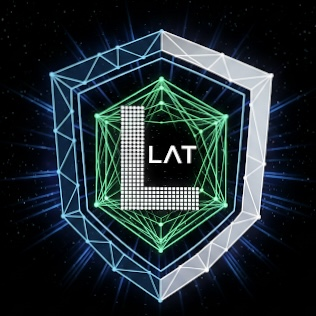

#  LATTICE ($LAT)

LATTICE is a decentralized verification infrastructure designed to protect the Base ecosystem against quantum computation threats through the modular VERA Protocol.

### 🌐 Official Links
- **Website:** [https://lattice-labs-base.github.io/lattice/](https://lattice-labs-base.github.io/lattice/)
- **Telegram:** t.me/Lattice_LAT
- **BaseScan (Mainnet Asset Layer):** [https://basescan.org/token/0x0a320C8daC9fB56C7FC766CDF2c6068949fa4B74](https://basescan.org/token/0x0a320C8daC9fB56C7FC766CDF2c6068949fa4B74)
- **Live Terminal DApp:** [https://vera-sdk-mainnet.vercel.app/](https://vera-sdk-mainnet.vercel.app/)
- **SDK JavaScript Distribution:** [https://vera-sdk-mainnet.vercel.app/vera-pqc-sdk.js](https://vera-sdk-mainnet.vercel.app/vera-pqc-sdk.js)

### 📊 Project Status
- **Current Core Phase:** Phase 4: Production Mainnet Deployment & Developer SDK Active
- **Asset Settlement:** Base Mainnet ($LAT Token Layer)
- **Verification Engine:** Go-based ML-DSA-87 Engine (Render Microservice)
- **Blockchain Anchor:** Base Mainnet
- **Security & Integrity:** Production-Oriented Post-Quantum Anchoring Architecture
- **LAT Token Contract:** `0x0a320C8daC9fB56C7FC766CDF2c6068949fa4B74`
- **VERA Anchor Contract (Base Mainnet V5):** `0x34233747E842082fCfeAC2f248159EcB4a6c6f04`

---

### 🏗️ System Architecture

<pre><code>  [ Web3 Wallet / External DApp ]
                 │
                 ▼
  [ VERA PQC Client SDK / Terminal ]
                 │
                 ▼
     [ Vercel Routing Layer ]
                 │
                 ▼
   [ Go PQC Engine (Render Node) ]
   (ML-DSA-87 / NIST FIPS 204)
                 │
                 ▼
   [ Base Mainnet Anchor Contract ]
  (0x3423...6f04 / commitProof)</code></pre>

---

### 🚀 VERA Terminal & Client Integration

VERA Protocol provides both a live interactive terminal and an integrable JavaScript SDK (`vera-pqc-sdk.js`) for Web3 application developers to secure EVM workflows against post-quantum threats.

#### ⚡ 1. One-Line SDK Integration
Developers can integrate post-quantum proof generation and Base Mainnet anchoring directly into their HTML/JS application:

<pre><code>&lt;!-- Ethers.js Dependency --&gt;
&lt;script src="https://cdnjs.cloudflare.com/ajax/libs/ethers/5.7.2/ethers.umd.min.js"&gt;&lt;/script&gt;

&lt;!-- VERA PQC SDK --&gt;
&lt;script src="https://vera-sdk-mainnet.vercel.app/vera-pqc-sdk.js"&gt;&lt;/script&gt;

&lt;script&gt;
  // Initialize SDK
  const vera = new VeraSDK();

  async function runPQC() {
    try {
      // Step 1: Connect, generate ML-DSA-87 proof, and commit anchor to Base Mainnet in one call
      const result = await vera.anchor(window.ethereum);
      
      console.log("Transaction Hash:", result.transactionHash);
      console.log("BaseScan URL:", result.scanUrl);
    } catch (error) {
      console.error("PQC Anchoring Failed:", error);
    }
  }
&lt;/script&gt;</code></pre>

#### 🖥️ 2. Sandbox Terminal
- **Live Terminal DApp:** https://vera-sdk-mainnet.vercel.app/
- **Official Portal:** https://lattice-labs-base.github.io/lattice/

---

### 🛡️ Core Architecture & Technical Workflow

The VERA Protocol utilizes a dual-key routing topology that decouples standard ledger authorization from quantum-safe proof anchoring, enforcing an "Extend, not Replace" integration paradigm:

1. **Identity & Connectivity (CONNECT)**: Intercepts Web3 provider payloads and ensures chain alignment with Base Mainnet (Chain ID: `0x2105` / `8453`).
2. **Lattice Payload Computation (SECURE)**: The high-performance Go backend executes native ML-DSA-87 (Dilithium) signing based on NIST FIPS 204 post-quantum standards.
3. **On-Chain State Anchoring (VERIFY)**: Automatically commits the generated proof state hash to the `VERA_Protocol_V5_0` contract on Base Mainnet (`commitProof`), providing sub-cent transaction anchoring proof immutability.

---

### 🪙 Tokenomics & $LAT Utility
The **$LAT Token** serves as the primary economic asset governing and securing the post-quantum validation network:

- **Validator Staking Requirements**: Independent nodes running off-chain Verifier clusters must stake a required quota of $LAT tokens as collateral. Malicious actions or invalid proof commitments result in automatic collateral slashing.
- **Verification Fee Architecture**: External dApps requesting quantum-resistant state security cover bundle validation execution fees in $LAT, establishing continuous, utility-driven asset demand.

---

### 🗺️ Strategic Roadmap & Milestones

#### 🟩 Phase 1: Research & Architecture ✔ Completed
- Mathematical design and system architecture of EVM-compatible lattice-based cryptography.

#### 🟦 Phase 2: VERA Sandbox & Testnet Anchoring ✔ Completed
- Successful execution of testnet Proof of Concept (PoC) on Base Sepolia.
- Deployment and testing of internal Go-based proof computation microservices.

#### 🟨 Phase 3: PQC SDK & Middleware Foundation ✔ Completed
- Production-ready Go microservice deployment supporting ML-DSA-87 / NIST FIPS 204 algorithms.
- Release of `vera-pqc-sdk.js` for lightweight client-side dApp integration.

#### 🟥 Phase 4: Mainnet Deployment & Ecosystem Adoption (Active)
- **✔ Completed:** Full contract deployment onto Base Mainnet (`0x34233747E842082fCfeAC2f248159EcB4a6c6f04`).
- **✔ Completed:** Live End-to-End pipeline (Vercel DApp ⇔ Render Go Engine ⇔ Base Mainnet EVM).
- **In Progress:** Onboarding external Base ecosystem dApps to expand primary PQC verification coverage.

---

### ⚙️ Smart Contract Reference (Base Mainnet)

- **Network:** Base Mainnet (Chain ID: `8453` / `0x2105`)
- **Contract Address:** [`0x34233747E842082fCfeAC2f248159EcB4a6c6f04`](https://basescan.org/address/0x34233747E842082fCfeAC2f248159EcB4a6c6f04)
- **Core Interface:** `commitProof(string requestId, address userAddress, string proofHash, string polyMapping)`

---
© 2026 Lattice Labs. All rights reserved. Selected implementation details remain proprietary.
